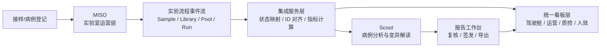
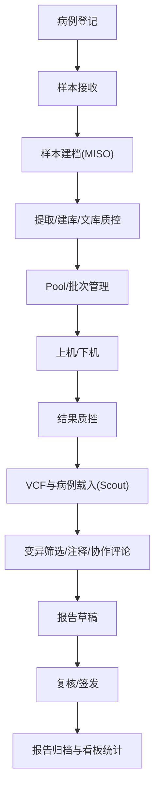

# MISO + Scout 临床基因检测实验室方案设计文档

更新时间：2026-03-18  
适用对象：临床基因检测实验室、分子诊断平台、遗传病/肿瘤检测中心  
文档用途：用于内部评审、原型规划、Demo 选型和后续产品化拆解

## 1. 文档结论

`MISO + Scout` 是一条很适合做临床基因检测实验室 Demo 的开源组合路线：

- `MISO` 负责实验室运营链路，覆盖样本、建库、文库、Pooling 等实验流程管理。
- `Scout` 负责变异分析与病例协作，覆盖 VCF 浏览、病例解读、评论协作、覆盖度查看和报告前分析。
- 我们自己的 `看板层 / 报告层 / 集成层` 负责把二者串成一套“临床基因检测实验室智慧看板系统”。

这套方案的核心价值不是把两个开源项目简单拼起来，而是形成一条完整业务链：

`接样 -> 建库 -> 上机 -> 质控 -> 生信分析 -> 变异解读 -> 报告复核 -> 签发归档 -> 经营看板`

## 2. 设计目标

### 2.1 业务目标

- 支撑临床基因检测实验室从样本接收到报告签发的全过程可视化。
- 支撑实验室主管查看产能、时效、异常、设备与质量风险。
- 支撑分析师在病例维度完成变异筛选、注释查看、协作评论与结论确认。
- 支撑管理层用统一驾驶舱查看样本量、TAT、报告效率、异常和资源利用率。

### 2.2 Demo 目标

- 能在较低成本下跑通可演示的端到端流程。
- 优先复用成熟开源系统，减少从零造业务后台的工作量。
- 保留后续替换底层系统的能力，不把前端看板完全绑定在某一个开源项目内部页面上。

## 3. 选型判断

### 3.1 为什么选 MISO

根据其 GitHub README，MISO 是 “open source LIMS for small-to-large scale sequencing centres”，并且提供 Docker Compose Demo。公开文档里可直接确认：

- 支持快速启动 Demo。
- 支持 `Sample -> Library -> Library Aliquot -> Pool` 的标准测序实验流程。
- 支持更细颗粒度的样本层级，如 `Identity -> Tissue -> Slide -> gDNA(stock) -> gDNA(aliquot)`。

这说明它非常适合承担临床基因检测实验室的“实验室运营骨架”。

### 3.2 为什么选 Scout

根据其 GitHub README，Scout 是 `VCF visualization interface`，公开文档里可直接确认：

- 支持 Docker Demo。
- 支持把多个分析结果和 VCF 聚合到中心数据库。
- 支持评论协作与病例共享。
- 支持基因 panel、病例加载、覆盖度可视化、局部频率库集成。
- 支持导出 PDF 报告所需能力。

这说明它非常适合承担“病例分析与变异解读前台”。

### 3.3 为什么不是直接只用其中一个

- 只用 `MISO`：实验室流程够强，但变异解读、病例协作、分析视图不够强。
- 只用 `Scout`：病例分析够强，但样本接收、建库、上机前后实验流程不够强。
- `MISO + Scout`：刚好覆盖临床基因检测实验室里最关键的两段链路。

## 4. 方案边界

### 4.1 本方案覆盖范围

- 受检者 / 病例建档
- 样本接收与实验流转
- 批次、建库、Pooling、上机前后状态跟踪
- 质控结果汇总
- VCF 级变异浏览与病例分析
- 报告前复核与签发流转
- 管理驾驶舱与业务看板

### 4.2 本方案暂不覆盖

- 原始测序数据处理引擎本身
- 复杂 LIS/HIS/EMR 全量互联
- 全面电子病历归档
- 医疗器械注册级闭环

这些能力可以作为二期集成项，不建议在 Demo 阶段过早压进去。

## 5. 总体设计

### 5.1 总体架构

### 5.2 分层职责

| 分层 | 系统 | 职责 |
| --- | --- | --- |
| 实验室运营层 | MISO | 样本、文库、Aliquot、Pool、实验流转、批次状态 |
| 分析解读层 | Scout | VCF 浏览、病例分析、变异评论、覆盖度查看、病例协作 |
| 集成编排层 | 自研轻服务 | 主键映射、状态同步、任务编排、指标计算、报告状态管理 |
| 驾驶舱与工作台层 | 当前看板前端 | 总览、质控、人效、实验室管理、报告视图 |
| 报告资产层 | 自研或外接 | 报告模板、PDF、签发记录、回执归档 |

### 5.3 关键设计原则

- `MISO` 做事实源，不让看板直接承担流程录入职责。
- `Scout` 做分析工作台，不让它承担全实验室运营逻辑。
- `看板系统` 作为统一门面，屏蔽底层系统差异。
- `病例 ID / 样本 ID / 批次 ID / 分析 Case ID` 必须做统一映射。
- 所有大屏指标都必须能钻取到样本、病例、批次或责任人。

## 6. 业务流程设计

### 6.1 端到端流程

### 6.2 关键状态机

建议统一抽象一套对外状态，不直接暴露底层系统全部状态：

| 统一状态 | 对应业务含义 | 主要来源 |
| --- | --- | --- |
| 已接样 | 样本已登记、待处理 | MISO |
| 实验中 | 提取、建库、文库质控中 | MISO |
| 待上机 | 已完成实验准备、等待批次 | MISO |
| 测序中 | 批次已运行、待结果回传 | MISO / 测序平台 |
| 质控中 | 下机数据或结果质控处理中 | 自研看板 / 分析流程 |
| 待解读 | 结果已进入病例分析 | Scout |
| 解读中 | 分析师处理中 | Scout |
| 待复核 | 已形成草稿结论，待审核 | 自研报告层 |
| 待签发 | 审核通过，待正式签发 | 自研报告层 |
| 已发布 | 报告已发出 | 自研报告层 |
| 异常阻塞 | 任一环节超时、失败、回退 | 集成层计算 |

## 7. 数据模型设计

### 7.1 核心实体

| 实体 | 说明 | 主系统 |
| --- | --- | --- |
| Patient / Subject | 受检者或病例主体 | 自研主数据 |
| Case | 检测申请 / 病例单元 | 自研主数据 / Scout |
| Sample | 实体样本 | MISO |
| Library | 文库 | MISO |
| Aliquot | 样本分装 / 文库分装 | MISO |
| Pool | 混池 / 批次准备 | MISO |
| Sequencing Run | 上机批次 | MISO 或外部测序平台 |
| Analysis Case | 分析案例 | Scout |
| Variant | 变异记录 | Scout |
| Report | 报告对象 | 自研报告层 |
| Task / Review | 复核与签发任务 | 自研报告层 |

### 7.2 ID 映射建议

需要建立一张统一映射表，至少包含：

- `case_id`
- `patient_id`
- `sample_barcode`
- `miso_sample_id`
- `miso_library_id`
- `run_id`
- `scout_case_id`
- `report_id`

这是整个方案能不能稳定运行的关键点。  
如果 ID 映射做不好，后面所有看板、报表和钻取都会断裂。

### 7.3 对当前项目的字段建议

你们现有原型已经有这些页面：

- 实验室总览
- 测序下机数据质控
- 检测结果质量控制
- 人效分析
- 实验室管理 alpha 版

所以最适合新增或重命名的数据域是：

- `labCase`
- `sampleFlow`
- `seqRun`
- `resultQc`
- `variantReview`
- `reportWorkflow`
- `productivity`

## 8. 页面设计

### 8.1 首页总驾驶舱

首页建议继续保留你们当前“实验室总览”的定位，但数据来源要从模拟数据升级为 `MISO + Scout + 报告层` 联合结果。

建议模块：

- 今日接样数
- 在检样本数
- 待解读病例数
- 待签发报告数
- TAT 达成率
- 异常样本数
- 设备/批次异常
- 近 7/30 天报告趋势
- 流程滞留分布
- 样本状态漏斗

### 8.2 实验室运营页

由 `MISO` 驱动，展示：

- 按项目、批次、样本类型统计的接样趋势
- 样本在各实验阶段的数量与超时情况
- 建库 / Pool / Run 的排队情况
- 试剂、耗材和关键实验节点告警

### 8.3 测序质控页

延续你们当前 `测序下机数据质控` 页面，但把指标来源逐步对接真实流程：

- 下机批次列表
- Raw data 质控
- 文库/样本维度指标分布
- 阳控/阴控状态
- Index 组合异常
- 批次异常样本定位

### 8.4 结果质控与解读页

建议把你们当前 `检测结果质量控制` 与 `Scout` 能力结合：

- 病例列表
- VCF 浏览入口
- 热点位点统计
- 癌种 / Panel / 变异类型筛选
- 覆盖度查看
- 变异评论与协作记录
- 待确认结论和报告草稿状态

### 8.5 报告工作台

这是 `MISO + Scout` 之间最值得补的一层，也是你们项目最适合做差异化的地方。

建议模块：

- 报告草稿列表
- 待复核任务
- 待签发任务
- 退回原因统计
- 复核时长与签发时长
- 报告版本记录

### 8.6 人效分析页

继续保留你们现有页面，但指标改造成真实角色维度：

- 实验人员处理样本吞吐量
- 分析师病例解读量
- 复核人平均处理时长
- 各节点积压排名
- TAT 贡献拆分

## 9. 集成设计

### 9.1 集成策略

本方案建议不要在 Demo 阶段做双向深度耦合，而是采用 `松耦合集成`：

- `MISO -> 集成层`：同步样本、文库、Pool、Run、状态事件
- `分析流程 -> 集成层`：同步 VCF 产出、质控结果、分析完成事件
- `集成层 -> Scout`：注册或关联 case、传递分析数据入口
- `Scout -> 集成层`：同步病例分析状态、评论状态、结论状态
- `报告层 -> 看板`：同步复核、签发、归档状态

### 9.2 推荐的同步方式

- Demo 阶段：批量导入 + 定时同步
- 小规模上线：事件表 + 定时任务
- 生产阶段：消息队列或标准事件总线

### 9.3 指标计算位置

建议统一放在集成层或数据层，不要分散在前端页面里计算。

原因：

- 便于多个页面复用同一口径
- 便于做日报、周报、趋势图
- 便于后期接 BI 或数据仓库

## 10. Demo 落地建议

### 10.1 最小可演示范围

第一版 Demo 不需要做完整临床闭环，建议只跑通以下链路：

1. 病例与样本登记
2. MISO 中的样本流转与批次阶段
3. 批次下机后的质控结果展示
4. Scout 中的病例分析与变异评论
5. 报告草稿、待复核、待签发状态展示
6. 首页总览与异常中心

### 10.2 Demo 数据建议

建议构造三类案例：

- `正常完成案例`：完整流转到已发布
- `超时阻塞案例`：卡在建库、上机或复核
- `异常返工案例`：质控失败或报告退回

这样演示时才能体现系统的管理价值，而不是只展示顺畅流程。

### 10.3 技术落地建议

- 先保留你们现有前端原型结构。
- 用一层模拟 API 或 JSON Adapter 把 `MISO/Scout` 数据转成你们现有页面字段。
- 首页、实验室管理、结果质控三页优先接真实结构。
- 报告工作台先做轻量版，自定义实现，不要强依赖底层系统已有页面。

## 11. 风险与约束

### 11.1 主要风险

- `主数据不统一`：患者、病例、样本、报告之间 ID 断裂。
- `流程边界不清`：到底哪些状态归 MISO，哪些归 Scout，哪些归自研报告层。
- `演示体验割裂`：用户在多个系统之间反复跳转，像“拼盘系统”。
- `临床场景差异`：遗传病、肿瘤、感染方向的流程和字段差异较大。

### 11.2 缓解策略

- 先定义统一状态机和统一主键映射。
- 所有页面以“单一门户”方式提供入口。
- Demo 先选一个固定业务场景，比如 `肿瘤 panel 检测` 或 `遗传病 trio 分析`。
- 把“报告工作台”做成统一出口，弱化底层系统边界。

## 12. 对你们当前原型的改造建议

从你们当前项目出发，最稳妥的迭代方式是：

| 当前页面 | 新定位 | 主要数据来源 |
| --- | --- | --- |
| 实验室总览 | 总驾驶舱 | MISO + Scout + 报告层 |
| 测序下机数据质控 | 批次质控页 | MISO + 分析流程 |
| 检测结果质量控制 | 结果质控与病例解读页 | Scout + 结果数据库 |
| 人效分析 | 流程效率与角色效率页 | 集成层统计 |
| 实验室管理 alpha 版 | 样本与报告运营页 | MISO + 报告层 |
| 科研画图服务 | 可保留为附加工具页 | 独立模块 |

## 13. 分阶段规划

### 13.1 Phase 1：Demo 版

- 接入 MISO 的样本流转概念
- 接入 Scout 的病例分析概念
- 完成首页、运营页、解读页、报告工作台
- 用适量模拟数据补齐尚未打通的字段

### 13.2 Phase 2：试点版

- 接真实项目、真实 panel、真实批次
- 引入角色权限
- 引入复核、签发、退回闭环
- 打通导出与报告归档

### 13.3 Phase 3：产品版

- 对接 LIS/HIS/EMR
- 对接设备、环境、告警
- 引入审计追踪、电子签名、质控规则引擎
- 引入统一 BI 和经营分析

## 14. 方案判断

如果目标是 `快速做出一个可信的临床基因检测实验室 Demo`，`MISO + Scout` 是值得采用的方案。

它的优势是：

- 开源可验证
- 跟真实基因检测实验室链路接近
- 同时覆盖实验室运营和病例解读
- 适合你们现有“看板 + 质控 + 报告”原型继续演进

它的不足是：

- 仍然需要一层自研集成和统一看板
- 报告闭环不能完全靠开源项目直接补齐
- 临床化落地仍需结合你们具体业务场景裁剪

## 15. 说明与参考来源

说明：

- 本文中关于 `MISO 负责实验室运营骨架、Scout 负责病例分析前台、我们自研看板负责统一门面` 的系统分工，属于基于公开能力边界做出的产品设计推断。
- 这是一份 `方案设计文档`，不是厂商官方集成文档，因此集成方式、数据同步方式和页面拆分是面向你们项目目标的设计建议。

参考来源：

- MISO GitHub README：[https://github.com/miso-lims/miso-lims](https://github.com/miso-lims/miso-lims)
- MISO 文档站：[https://miso-lims.readthedocs.io/](https://miso-lims.readthedocs.io/)
- Scout GitHub README：[https://github.com/Clinical-Genomics/scout](https://github.com/Clinical-Genomics/scout)
- Scout 文档站：[https://clinical-genomics.github.io/scout](https://clinical-genomics.github.io/scout)
