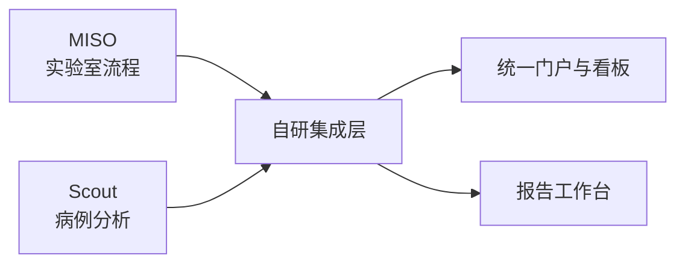

# MISO + Scout 方案老板汇报版

更新时间：2026-03-18  
适用场景：临床基因检测实验室 Demo 方案汇报 / 内部立项评审 / 客户沟通

## 1. 一句话结论

建议采用 `MISO + Scout + 自研看板层` 的组合路线，快速搭建一套适用于临床基因检测实验室的 Demo 系统。

- `MISO` 负责实验室流程管理
- `Scout` 负责病例分析与变异解读
- `自研看板层` 负责统一门户、经营驾驶舱、报告工作台和异常闭环

这条路线的优势是：`真实业务链路接近临床场景、开源可验证、演示价值高、二次扩展空间大`。

## 2. 为什么选这套方案

### 2.1 业务上可行

临床基因检测实验室最关键的不是单一页面，而是一条完整链路：

`接样 -> 实验流转 -> 上机下机 -> 结果质控 -> 变异解读 -> 报告复核 -> 签发归档`

单独使用一个系统很难完整覆盖：

- `只用 MISO`：实验流程强，但病例分析和变异解读不足
- `只用 Scout`：变异分析强，但实验室运营链路不足
- `组合使用`：刚好覆盖实验室与分析两端

### 2.2 Demo 上可行

- 两个项目都能在 GitHub 上找到公开仓库和文档
- 两个项目都具备 Demo / Docker 启动基础
- 我们现有原型已具备总览、质控、人效、实验室管理等页面骨架，能快速承接

## 3. 我们要做的不是“拼盘”，而是统一门面

项目最终形态不是让用户在两个开源系统之间来回切，而是做成：

统一门户承担三件事：

- 统一状态口径
- 统一指标计算
- 统一页面入口

## 4. 方案能带来的价值

### 4.1 对领导层

- 一屏看清样本量、TAT、报告效率、异常情况
- 能看到流程瓶颈、实验产能和人员负荷
- 能展示“从实验到报告”的完整闭环能力

### 4.2 对实验室主管

- 可跟踪样本在接样、建库、Pool、上机、质控等节点的滞留情况
- 可查看批次、异常样本、超时任务和资源风险
- 可快速定位运营问题在哪个环节、哪个批次、哪个责任人

### 4.3 对分析师 / 报告团队

- 能在病例维度查看变异、注释、覆盖度和协作评论
- 能把分析结论与报告流程衔接起来
- 能清楚区分待解读、待复核、待签发、已发布状态

## 5. 首版系统建议长什么样

建议首版做成 `1 + 3 + 1`：

- `总驾驶舱`
- `实验室运营页`
- `结果质控与病例解读页`
- `人效分析页`
- `报告工作台`

其中最值得做强的是三个地方：

- `首页总驾驶舱`：面向汇报与管理
- `实验室运营页`：体现 MISO 的流程价值
- `报告工作台`：体现你们自己的差异化能力

## 6. 首版 MVP 范围

建议只做最有演示价值的一条闭环，不求一次做全：

1. 病例与样本登记
2. 样本在实验室阶段的流转状态
3. 下机后质控结果展示
4. 病例级变异分析入口
5. 报告草稿、待复核、待签发、已发布状态
6. 首页驾驶舱与异常中心

这样既能体现临床基因检测实验室特色，也不会因为系统过大而拖慢 Demo 节奏。

## 7. 风险和应对

### 7.1 主要风险

- `ID 不统一`：病例、样本、批次、报告关联不上
- `页面割裂`：看起来像多个系统拼接
- `流程边界不清`：不知道哪些状态归 MISO，哪些归 Scout，哪些归自研层

### 7.2 应对策略

- 先定义统一主键映射和统一状态机
- 所有展示页面都走统一门户
- 报告相关动作统一收敛到报告工作台

## 8. 建议决策

### 8.1 推荐方案

继续沿用你们现有前端原型，采用：

`MISO + Scout + 轻量集成层 + 自研看板/报告层`

### 8.2 不推荐方案

- 不建议只做一个炫酷大屏，没有业务闭环
- 不建议完全深改开源项目内部页面，维护成本高
- 不建议在首版就做全量 LIS/HIS/EMR 集成

## 9. 预期产出

如果按这条路线推进，首版 Demo 可以形成三类成果：

- `可汇报`：总驾驶舱、实验室态势、报告效率
- `可演示`：样本流转、病例解读、报告状态闭环
- `可延展`：后续能继续接真实数据、角色权限和医院接口

## 10. 下一步建议

下一步建议按这个顺序推进：

1. 先定统一状态机和字段映射
2. 再定首页、实验室运营页、报告工作台的信息架构
3. 最后决定哪些数据先模拟、哪些数据接真实 Demo
