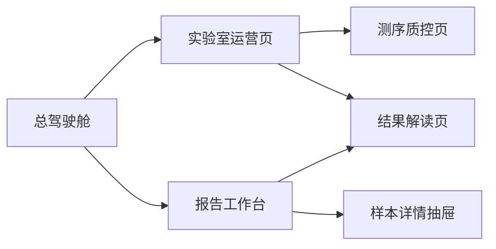

# MISO + Scout 核心页面信息架构与线框草图

更新时间：2026-03-18  
页面范围：`首页总驾驶舱`、`实验室运营页`、`报告工作台`  
适用目的：原型设计、评审讨论、前端实现、数据字段梳理

## 1. 设计原则

三张核心页面需要同时满足三件事：

- `能汇报`：领导能快速理解实验室当前状态
- `能管理`：主管能定位卡点、异常和责任人
- `能行动`：用户能从指标钻取到明细，并进入对应处理页

统一原则如下：

- 顶部先放 `结果型 KPI`
- 中部放 `过程型图表`
- 底部放 `异常与明细`
- 每个关键卡片都要有 `钻取入口`
- 页面之间通过 `样本 / 病例 / 批次 / 报告` 四类对象打通

## 2. 全局导航建议

建议在现有项目左侧导航基础上收敛为：

- `总驾驶舱`
- `实验室运营`
- `测序质控`
- `结果解读`
- `报告工作台`
- `人效分析`
- `系统管理`

建议顶部保留统一筛选条：

- 时间范围
- 项目类型
- 检测产品
- 实验室 / 科室
- 样本类型
- 状态筛选

这样所有页面的数据口径会更统一。

## 3. 页面一：首页总驾驶舱

### 3.1 页面目标

- 给领导和主管一眼看清实验室当前经营与运行状态
- 快速回答“量有多少、快不快、哪里堵了、风险在哪”

### 3.2 信息架构

| 区块 | 模块 | 目标 | 数据来源 |
| --- | --- | --- | --- |
| 顶部 KPI | 今日接样、在检样本、待解读病例、待签发报告、TAT 达成率、异常数 | 快速看结果 | MISO + Scout + 报告层 |
| 左侧 | 样本状态漏斗、流程滞留排行 | 看流程健康度 | MISO |
| 中部 | 实验室总态势、批次趋势、报告趋势 | 看整体运行与趋势 | 集成层 |
| 右侧 | 实时告警、超时任务、复核阻塞、质控异常 | 看当前风险 | 集成层 |
| 底部 | 最近异常样本、最近待签发报告、关键责任人工作负载 | 看明细和责任归属 | 报告层 + 集成层 |

### 3.3 页面结构建议

```text
+--------------------------------------------------------------------------------------------------+
| 页头：总驾驶舱                                  [日期] [项目] [产品] [实验室] [刷新]             |
+--------------------------------------------------------------------------------------------------+
| KPI1 今日接样 | KPI2 在检样本 | KPI3 待解读病例 | KPI4 待签发报告 | KPI5 TAT达成率 | KPI6 异常数 |
+--------------------------------------+--------------------------------------+----------------------+
| 样本状态漏斗                         | 近7/30天批次与报告趋势               | 实时异常中心         |
| - 已接样                             | - 接样趋势                           | - 质控异常           |
| - 实验中                             | - 下机趋势                           | - 超时任务           |
| - 测序中                             | - 已发布报告趋势                     | - 退回报告           |
| - 待解读                             | - TAT趋势                            | - 设备/批次异常      |
| - 已发布                             |                                      |                      |
+--------------------------------------+--------------------------------------+----------------------+
| 流程滞留排行                         | 实验室/项目产能排行                  | 待办提醒             |
| - 建库滞留                           | - 项目吞吐                           | - 待复核             |
| - 上机滞留                           | - 实验室完成率                       | - 待签发             |
| - 解读滞留                           | - 分析师负载                         | - 校准到期           |
+--------------------------------------------------------------------------------------------------+
| 明细表：异常样本 / 待签发报告 / 超时病例                                                        |
+--------------------------------------------------------------------------------------------------+
```

### 3.4 KPI 定义建议

首页最关键的 6 个指标：

- `今日接样`
- `在检样本`
- `待解读病例`
- `待签发报告`
- `TAT 达成率`
- `异常样本数`

每个 KPI 需要支持：

- 同比/环比
- 点击后进入明细列表
- 明细表支持导出

### 3.5 钻取路径

建议钻取逻辑：

- 点击 `在检样本` -> 进入实验室运营页，并自动筛选 `状态 = 在检`
- 点击 `待解读病例` -> 进入结果解读页，并自动筛选 `状态 = 待解读`
- 点击 `待签发报告` -> 进入报告工作台，并自动筛选 `状态 = 待签发`
- 点击 `异常数` -> 打开异常中心抽屉或异常列表页

### 3.6 页面实现优先级

- P0：KPI、趋势图、异常中心、明细表
- P1：责任人负载、项目排名、实验室视角切换
- P2：地图/楼层/空间态势视图

## 4. 页面二：实验室运营页

### 4.1 页面目标

- 让实验室主管知道样本卡在哪、批次排到哪、资源够不够
- 把 MISO 的流程价值翻译成一套易懂的运营看板

### 4.2 信息架构

| 区块 | 模块 | 目标 | 数据来源 |
| --- | --- | --- | --- |
| 顶部 KPI | 接样数、建库数、待上机数、测序中批次、超时任务、试剂预警 | 看产能和风险 | MISO + 集成层 |
| 左侧 | 样本分层流转图 | 看样本从 Sample 到 Pool 的进度 | MISO |
| 中部 | 批次排程、上机状态、节点耗时趋势 | 看调度和效率 | MISO + 集成层 |
| 右侧 | 试剂库存、设备状态、告警 | 看资源保障 | 集成层 |
| 底部 | 样本明细表、批次明细表、异常任务表 | 落地到具体对象 | MISO + 集成层 |

### 4.3 页面结构建议

```text
+--------------------------------------------------------------------------------------------------+
| 页头：实验室运营                                  [时间] [项目] [样本类型] [实验室] [批次状态]   |
+--------------------------------------------------------------------------------------------------+
| 接样数 | 建库数 | 待上机数 | 测序中批次 | 超时任务 | 试剂预警 |
+--------------------------------------+--------------------------------------+----------------------+
| 样本流转总览                         | 批次排程与上机状态                   | 资源与告警           |
| Identity -> Tissue -> gDNA ->        | - 待排批次                           | - 试剂库存预警       |
| Library -> Aliquot -> Pool           | - 已上机批次                         | - 设备在线率         |
| 各节点数量/超时/退回                 | - 下机中批次                         | - 校准到期           |
+--------------------------------------+--------------------------------------+----------------------+
| 节点耗时趋势                         | 项目/实验室产能排行                  | 异常任务排行         |
| - 接样到建库                         | - 每日完成样本数                     | - 建库超时           |
| - 建库到Pool                         | - 每周完成批次数                     | - 上机等待过长       |
| - Pool到上机                         | - 平均周转时间                       | - 失败返工           |
+--------------------------------------------------------------------------------------------------+
| Tab1 样本明细 | Tab2 批次明细 | Tab3 异常任务                                                  |
+--------------------------------------------------------------------------------------------------+
```

### 4.4 核心表格字段建议

`样本明细表`

- 样本条码
- 病例编号
- 项目类型
- 当前状态
- 当前节点责任人
- 节点开始时间
- 已停留时长
- 是否超时
- 是否异常

`批次明细表`

- 批次号
- 上机平台
- 批次状态
- 样本数
- Pool 数
- 计划上机时间
- 实际上机时间
- 下机时间
- 批次异常

### 4.5 钻取路径

- 点击流转节点 -> 展示该节点样本列表
- 点击超时任务 -> 打开异常任务表并自动筛选
- 点击批次号 -> 进入测序质控页
- 点击病例编号 -> 进入结果解读页

### 4.6 页面实现优先级

- P0：样本流转、批次排程、样本明细、批次明细
- P1：节点耗时趋势、异常任务排行
- P2：库存联动、设备联动

## 5. 页面三：报告工作台

### 5.1 页面目标

- 把 `变异解读 -> 报告复核 -> 正式签发` 做成统一出口
- 避免用户在 Scout 和内部系统之间反复切换

### 5.2 信息架构

| 区块 | 模块 | 目标 | 数据来源 |
| --- | --- | --- | --- |
| 顶部 KPI | 待复核、待签发、退回报告、超时报告、今日已发布 | 看报告闭环效率 | 报告层 + Scout |
| 左侧 | 报告状态漏斗 | 看从草稿到签发的进度 | 报告层 |
| 中部 | 报告任务列表 | 看当前所有报告任务 | 报告层 |
| 右侧 | 复核意见、退回原因、分析摘要 | 看上下文 | 报告层 + Scout |
| 底部 | 版本记录、操作日志、PDF 预览入口 | 看审计和交付物 | 报告层 |

### 5.3 页面结构建议

```text
+--------------------------------------------------------------------------------------------------+
| 页头：报告工作台                                  [时间] [项目] [审核人] [状态] [导出]           |
+--------------------------------------------------------------------------------------------------+
| 待复核 | 待签发 | 退回报告 | 超时报告 | 今日已发布 |
+--------------------------------------+--------------------------------------+----------------------+
| 报告状态漏斗                         | 报告任务主表                         | 右侧详情区           |
| 草稿 -> 待复核 -> 待签发 -> 已发布   | 列：报告号 / 病例 / 项目 / 当前状态    | - 分析摘要           |
| 各状态数量 / 平均停留时长            |     / 分析师 / 审核人 / 截止时间       | - 退回原因           |
|                                      |     / 风险标识                        | - 复核意见           |
+--------------------------------------+--------------------------------------+----------------------+
| 版本记录                             | 操作日志                              | PDF/草稿预览         |
| - V1/V2/V3                           | - 谁在什么时候做了什么               | - 打开预览           |
| - 退回次数                           | - 审核/签发/退回动作                 | - 下载 PDF           |
+--------------------------------------------------------------------------------------------------+
```

### 5.4 报告主表字段建议

- 报告号
- 病例编号
- 样本条码
- 项目类型
- 当前状态
- 风险等级
- 分析师
- 复核人
- 签发人
- 创建时间
- 截止时间
- 超时标记
- 退回次数

### 5.5 右侧详情区建议

点击任意一条报告任务后，右侧展示：

- 病例摘要
- 关键变异摘要
- 质控结果摘要
- 复核意见
- 退回原因
- 最近一次操作人和操作时间

这样用户不需要先跳到别的系统，先在工作台就能完成判断。

### 5.6 钻取路径

- 点击病例编号 -> 打开结果解读页或 Scout 分析页
- 点击样本条码 -> 打开样本详情抽屉
- 点击状态漏斗 -> 自动筛选主表
- 点击 PDF 预览 -> 打开报告预览弹层

### 5.7 页面实现优先级

- P0：状态 KPI、报告主表、右侧详情、状态筛选
- P1：版本记录、日志、退回原因统计
- P2：内嵌 PDF 预览、在线批注

## 6. 三页之间的联动关系



联动建议：

- 首页负责发现问题
- 实验室运营页负责定位实验环节问题
- 报告工作台负责处理报告闭环问题

## 7. 统一组件建议

为了让三页看起来是同一套系统，建议统一这些组件：

- KPI 卡片组件
- 趋势图组件
- 状态漏斗组件
- 异常列表组件
- 主表 + 右侧详情布局
- 风险标签与状态色

状态色建议：

- `蓝色`：处理中
- `绿色`：已完成 / 正常
- `橙色`：待处理 / 临近超时
- `红色`：异常 / 超时 / 退回
- `灰色`：未开始 / 暂无数据

## 8. 对当前原型的改造映射

| 当前页面 / 模块 | 建议保留 | 建议调整 |
| --- | --- | --- |
| 实验室总览 | 保留骨架 | 指标改成 MISO + Scout + 报告层联合口径 |
| 各流程环节滞留情况 | 保留 | 改成统一状态机 + 可点击钻取 |
| 测序下机数据质控 | 保留 | 增加从运营页和批次号联动进入 |
| 检测结果质量控制 | 保留主要图表 | 增加病例列表、VCF 入口、解读状态 |
| 实验室管理 alpha 版 | 升级 | 重构为实验室运营页 |
| 新增模块 | 必须新增 | 报告工作台 |

## 9. 开发拆分建议

如果接下来要进入实现，建议按下面顺序拆：

1. 统一状态机与路由参数
2. 首页 KPI + 异常中心
3. 实验室运营页主表与流转图
4. 报告工作台主表与右侧详情
5. 页面间钻取联动
6. 版本记录、日志、导出等增强功能

## 10. 交付建议

这份文档适合作为下一步三类工作的输入：

- 产品：继续出高保真原型
- 前端：搭建页面骨架和通用组件
- 数据：定义字段口径和接口返回结构
