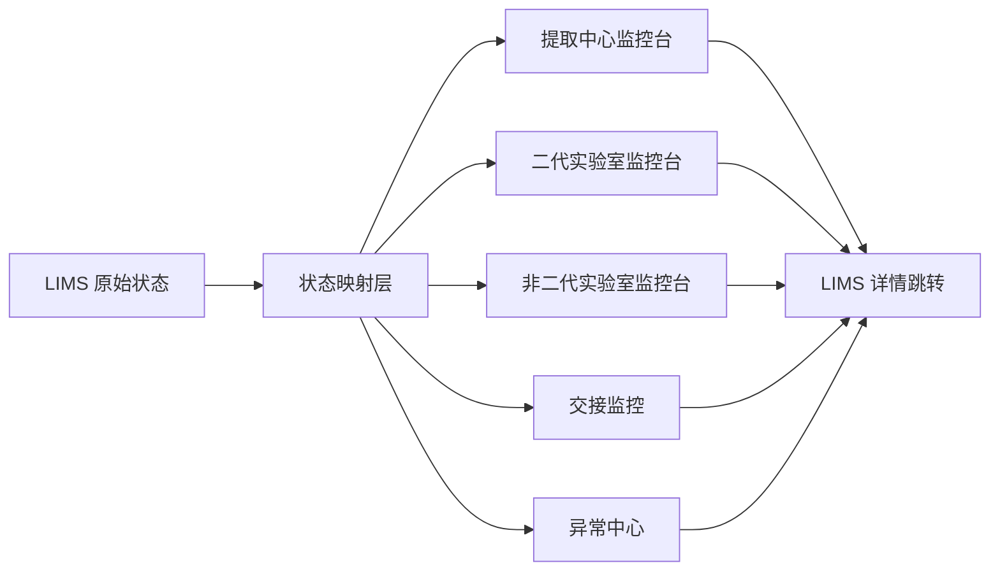

# 实验室中心状态映射与页面结构设计

更新时间：2026-03-24  
文档定位：实验室中心详细设计文档  
适用对象：产品经理、设计师、研发、实施、数据团队  
使用前提：本系统只读 LIMS 数据，无权修改 LIMS 原始状态

## 1. 文档结论

在“所有状态均来自 LIMS、当前产品只负责提示和报警”的前提下，实验室中心不应设计成流程执行系统，而应设计成：

`面向提取中心、二代实验室、非二代实验室的运行监控与预警平台。`

这意味着产品的主要职责不是“改状态”，而是：

- 统一展示 LIMS 原始状态
- 把原始状态映射成业务上可理解的中心视图
- 计算超时、堵点、失控、异常波动和交接断点
- 提醒责任人，并引导用户回到 LIMS 处理

## 2. 设计边界

### 2.1 本系统能做什么

- 拉取并展示 LIMS 状态
- 做状态映射和流程聚合
- 计算 SLA、停留时长和风险等级
- 识别异常和交接断点
- 提供明细查询、筛选、导出、通知和 LIMS 跳转

### 2.2 本系统不能做什么

- 修改 LIMS 状态
- 变更责任人
- 做签收、退回、完成等流程动作
- 写入实验执行记录
- 替代 LIMS 作为事实源

### 2.3 关键设计原则

- `原始状态只读`
- `业务状态可映射`
- `监控状态可计算`
- `动作回到 LIMS`

## 3. 三层状态模型

建议所有实验室中心统一采用三层状态模型：

| 层级 | 定义 | 来源 | 示例 |
| --- | --- | --- | --- |
| 原始状态 | LIMS 中真实保存的状态 | LIMS | `DNA提取完成`、`待上机`、`FISH待阅片` |
| 业务映射状态 | 按中心重组后的业务节点 | 本系统规则 | `提取中心/待交接`、`二代实验室/待下机QC` |
| 监控状态 | 结合 SLA 和规则计算的风险状态 | 本系统计算 | `正常`、`即将超时`、`已超时`、`异常`、`阻塞` |

### 3.1 状态设计示例

| LIMS 原始状态 | 业务映射状态 | 监控状态 |
| --- | --- | --- |
| DNA提取完成 | 提取中心/待交接 | 正常 |
| DNA提取完成 | 提取中心/待交接 | 已超时 |
| 待上机 | 二代实验室/待上机 | 即将超时 |
| FISH待阅片 | 非二代实验室/待判读 | 已超时 |

### 3.2 好处

- 不和 LIMS 抢主状态定义权
- 页面能统一展示不同实验室的业务视图
- 预警逻辑可独立演进
- 报表统计口径更稳定

## 4. 实验室中心总体信息架构

建议 `实验室中心` 作为一个一级导航，内部拆分为以下二级页：

- `总览`
- `提取中心`
- `二代实验室`
- `非二代实验室`
- `交接监控`
- `异常中心`

### 4.1 总体结构

### 4.2 为什么要单独做交接监控

在只读模式下，最有价值的不是“某一步执行了没有”，而是：

- 上游是否已经到可交接状态
- 下游是否及时接住
- 是否卡在中心边界上
- 卡住之后有没有持续放大成风险

所以 `交接监控` 必须是独立页面，而不是附属筛选条件。

## 5. 核心对象设计

实验室中心建议围绕以下对象建立监控视图：

| 对象 | 作用 | 主要适用中心 |
| --- | --- | --- |
| 样本 | 全流程最主干对象 | 提取中心、非二代实验室 |
| 材料 | 提取产物，如 DNA/RNA/切片 | 提取中心 |
| 工单 | 每次实验执行任务的载体 | 提取中心、非二代实验室 |
| 批次 | 二代实验室组织单元 | 二代实验室 |
| Run | 上机和下机的核心运行对象 | 二代实验室 |
| 方法模板 | 非二代实验室流程模板 | 非二代实验室 |
| 交接记录 | 中心之间的衔接证据 | 交接监控 |
| 异常事件 | 所有风险统一容器 | 异常中心 |

## 6. 提取中心设计

### 6.1 提取中心定位

提取中心是共享前处理中心，核心不是“批次”，而是：

- 样本是否进入提取
- 提取得到什么材料
- 材料质量是否达标
- 材料是否及时交给下游中心

### 6.2 提取中心主监控对象

- `样本`
- `提取工单`
- `材料`

### 6.3 提取中心业务映射状态建议

| LIMS 原始状态示例 | 业务映射状态 | 说明 |
| --- | --- | --- |
| 已接样 | 待提取 | 已进入提取中心待处理 |
| DNA提取中 | 提取中 | 正在提取 |
| RNA提取中 | 提取中 | 正在提取 |
| 提取完成待质检 | 待质检 | 提取完成但未出质检结论 |
| DNA质检通过 | 质检通过 | 可进入交接 |
| RNA质检通过 | 质检通过 | 可进入交接 |
| DNA质检不通过 | 质检不通过 | 需补提或人工确认 |
| 待交接二代 | 待交接 | 待送往二代实验室 |
| 待交接非二代 | 待交接 | 待送往非二代实验室 |
| 已交接 | 已交接 | 下游已接收或进入下游流程 |
| 待补提 | 待补提 | 提取失败或质量不足 |

### 6.4 提取中心页面结构

#### 页面 1：提取中心监控台

建议页面模块：

- 顶部 KPI
- 样本状态分布
- 今日提取吞吐趋势
- 质检通过/失败趋势
- 待交接和超时未交接监控
- 风险样本清单

#### 顶部 KPI 建议

- 今日待提取
- 提取中
- 待质检
- 质检不通过
- 待交接
- 超时未交接

#### 风险清单重点展示

- 待提取超时
- 提取中停留过长
- 提取完成后长时间未质检
- 质检失败后未进入补提
- 质检通过后未交接下游

#### 页面 2：材料视图

建议展示：

- DNA/RNA 产量分布
- 浓度/纯度分布
- 低质量材料列表
- 按项目/样本类型的材料质量对比

#### 页面 3：提取交接视图

建议展示：

- 待交接二代
- 待交接非二代
- 已交接但下游未启动
- 超时未交接

### 6.5 提取中心主列表字段建议

| 字段 | 说明 |
| --- | --- |
| 样本号 | 主标识 |
| 订单号/病例号 | 业务来源 |
| 项目 | 检测项目 |
| 样本类型 | 血浆、组织、蜡块等 |
| 当前 LIMS 状态 | 原始状态 |
| 业务映射状态 | 待提取/提取中/待质检等 |
| 进入当前状态时间 | 用于计时 |
| 当前停留时长 | 用于判断超时 |
| 提取工单号 | 追溯提取任务 |
| 材料类型 | DNA/RNA/其他 |
| 材料产量 | 数值型字段 |
| 材料质量结论 | 合格/不合格/待确认 |
| 下游目标中心 | 二代或非二代 |
| 风险等级 | 正常/黄/橙/红 |
| LIMS 跳转链接 | 处理入口 |

### 6.6 提取中心预警规则建议

| 规则类型 | 示例 |
| --- | --- |
| 超时规则 | 待提取超过 4 小时 |
| 超时规则 | 提取中超过 8 小时 |
| 超时规则 | 提取完成待质检超过 2 小时 |
| 交接规则 | 质检通过后 2 小时未交接 |
| 质量规则 | 材料浓度低于阈值 |
| 质量规则 | 提取失败率在某项目上异常上升 |

## 7. 二代实验室设计

### 7.1 二代实验室定位

二代实验室适合按 `批次 + Run + 文库 + 样本集合` 的方式监控，因为很多动作是成批发生的。

### 7.2 二代实验室主监控对象

- `批次`
- `Run`
- `样本集合`
- `下机质控结果`

### 7.3 二代实验室业务映射状态建议

| LIMS 原始状态示例 | 业务映射状态 | 说明 |
| --- | --- | --- |
| 待建库 | 待建库 | 材料已到达但未开始 |
| 建库中 | 建库中 | 正在实验执行 |
| 待Pooling | 待Pooling | 建库后等待批次组织 |
| 待上机 | 待上机 | 已具备上机条件 |
| 测序中 | 测序中 | Run 已启动 |
| 下机完成待QC | 待下机QC | 已下机等待判定 |
| 下机QC通过 | 质控通过 | 可交给生信 |
| 下机QC失败 | 质控失败 | 需要复核或重上机 |
| 待重上机 | 待重上机 | 已明确失败路径 |
| 已交生信 | 已交下游 | 流转给分析侧 |

### 7.4 二代实验室页面结构

#### 页面 1：二代实验室监控台

建议页面模块：

- 顶部 KPI
- 批次状态漏斗
- Run 时间轴
- 仪器利用率
- 下机质控概览
- 风险批次清单

#### 顶部 KPI 建议

- 待建库
- 建库中
- 待上机
- 测序中
- 待下机QC
- 质控失败批次
- 待交生信

#### 页面 2：批次监控页

建议展示：

- 批次号
- 项目组成
- 样本数
- 当前批次状态
- 批次总停留时长
- 当前风险

#### 页面 3：Run 监控页

建议展示：

- 测序仪
- Run 编号
- Flowcell
- 上机时间
- 预计下机时间
- 实际耗时
- 是否超计划

#### 页面 4：下机质控页

建议展示：

- Q30
- Yield
- 比对率
- 阳控/阴控
- 低产出样本占比
- 离群样本列表
- 待重上机候选批次

### 7.5 二代实验室主列表字段建议

| 字段 | 说明 |
| --- | --- |
| 批次号 | 主标识 |
| Run 编号 | 运行对象 |
| 项目组合 | 项目归类 |
| 样本数 | 规模信息 |
| 测序仪 | 设备维度 |
| 当前 LIMS 状态 | 原始状态 |
| 业务映射状态 | 待建库/待上机/待下机QC等 |
| 进入当前状态时间 | 计时基础 |
| 当前停留时长 | 用于超时计算 |
| 上机时间 | Run 时间 |
| 预计下机时间 | SLA 推算 |
| 下机时间 | 实际结果 |
| 质控摘要 | Q30/Yield/比对率摘要 |
| 阳阴控结果 | 是否在控 |
| 风险等级 | 正常/黄/橙/红 |
| LIMS 跳转链接 | 处理入口 |

### 7.6 二代实验室预警规则建议

| 规则类型 | 示例 |
| --- | --- |
| 超时规则 | 待建库超过 6 小时 |
| 超时规则 | 待上机超过 8 小时 |
| Run 规则 | Run 时长超过计划 20% |
| 质控规则 | 下机完成后 2 小时未完成 QC 判定 |
| 质控规则 | 阳控/阴控失控 |
| 质控规则 | 低产出样本比例超过阈值 |
| 交接规则 | QC 通过后 2 小时未交生信 |

## 8. 非二代实验室设计

### 8.1 非二代实验室定位

非二代实验室通常包含 PCR、FISH、IHC、片段分析等多种方法。  
它不适合直接复用二代实验室的 `批次/Run` 设计，应该以 `方法模板 + 工单` 为核心。

### 8.2 非二代实验室主监控对象

- `方法模板`
- `工单`
- `实验板/载玻片/批次`
- `样本`

### 8.3 非二代实验室状态设计原则

不建议做一套强统一主状态，而建议：

- 保留方法差异
- 在上层映射成统一监控节点

建议的统一监控节点：

- 待处理
- 执行中
- 待判读
- 待复核
- 待复检
- 已完成

### 8.4 方法模板映射示例

| 方法类型 | LIMS 原始状态示例 | 业务映射状态 |
| --- | --- | --- |
| PCR | 待上板 | 待处理 |
| PCR | 扩增中 | 执行中 |
| PCR | 待判读 | 待判读 |
| PCR | 待复检 | 待复检 |
| FISH | 待制片 | 待处理 |
| FISH | 杂交中 | 执行中 |
| FISH | 待阅片 | 待判读 |
| FISH | 待复核 | 待复核 |
| IHC | 待染色 | 待处理 |
| IHC | 染色中 | 执行中 |
| IHC | 待判读 | 待判读 |
| 片段分析 | 待分析 | 待判读 |
| 片段分析 | 待复核 | 待复核 |

### 8.5 非二代实验室页面结构

#### 页面 1：非二代实验室监控台

建议页面模块：

- 顶部 KPI
- 按方法分类的工单分布
- 各方法平均处理时长
- 各方法异常率/复检率趋势
- 风险工单清单

#### 顶部 KPI 建议

- 今日待处理工单
- 执行中工单
- 待判读
- 待复核
- 待复检
- 超时工单

#### 页面 2：方法模板监控页

建议支持按方法切换：

- PCR
- FISH
- IHC
- 片段分析
- 其他方法

每个方法页展示：

- 当前在制量
- 平均时长
- 复检率
- 异常工单

#### 页面 3：工单监控页

建议展示：

- 工单号
- 样本号
- 方法类型
- 当前步骤
- 当前责任人/责任组
- 当前停留时长
- 是否复检
- 是否异常

### 8.6 非二代实验室主列表字段建议

| 字段 | 说明 |
| --- | --- |
| 工单号 | 主标识 |
| 样本号 | 关联样本 |
| 项目 | 检测项目 |
| 方法类型 | PCR/FISH/IHC 等 |
| 当前 LIMS 状态 | 原始状态 |
| 业务映射状态 | 待处理/执行中/待判读等 |
| 当前步骤 | 模板内步骤 |
| 板位/批次/载玻片号 | 结构化执行信息 |
| 责任组/责任人 | 归属信息 |
| 进入当前状态时间 | 计时基础 |
| 当前停留时长 | 超时基础 |
| 是否复检 | 风险判断 |
| 异常标记 | 质量或流程异常 |
| 风险等级 | 正常/黄/橙/红 |
| LIMS 跳转链接 | 处理入口 |

### 8.7 非二代实验室预警规则建议

需要按方法配置，不建议统一一套：

| 方法 | 规则示例 |
| --- | --- |
| PCR | 待上板超过 4 小时 |
| PCR | 扩增失败率超阈值 |
| PCR | 待判读超过 2 小时 |
| FISH | 待阅片超过 6 小时 |
| FISH | 信号弱复检率异常上升 |
| IHC | 待染色超时 |
| IHC | 待复核超时 |
| 片段分析 | 待分析超时 |
| 片段分析 | 峰图异常比例超阈值 |

## 9. 交接监控设计

### 9.1 交接监控定位

交接监控是三大中心之间的边界监控页，核心不是做签收动作，而是识别：

- 上游已完成但未流转
- 下游应接未接
- 流转超时
- 因质量拦截未流转

### 9.2 交接监控建议拆分

- 提取中心 -> 二代实验室
- 提取中心 -> 非二代实验室
- 二代实验室 -> 结果/生信
- 非二代实验室 -> 结果/报告

### 9.3 交接监控页面结构

建议页面模块：

- 顶部 KPI
- 各交接链路漏斗
- 超时交接列表
- 被质量拦截列表
- 下游未接收列表

#### 顶部 KPI 建议

- 待交接总量
- 已超时未交接
- 已交接未启动
- 被拦截交接
- 今日已流转完成

### 9.4 交接监控主列表字段建议

| 字段 | 说明 |
| --- | --- |
| 样本号/批次号 | 根据链路显示 |
| 来源中心 | 提取/二代/非二代 |
| 目标中心 | 下游中心 |
| 当前 LIMS 状态 | 原始状态 |
| 交接类型 | 材料交接、批次交接、结果交接 |
| 进入可交接状态时间 | 计时起点 |
| 交接停留时长 | 超时计算 |
| 是否被质量拦截 | 拦截标识 |
| 拦截原因 | 质量/缺信息/其他 |
| 下游启动状态 | 已启动/未启动 |
| 风险等级 | 正常/黄/橙/红 |
| LIMS 跳转链接 | 处理入口 |

### 9.5 交接监控预警规则建议

| 规则类型 | 示例 |
| --- | --- |
| 交接超时 | 质检通过 2 小时后仍未进入下游 |
| 接收超时 | 上游已交接，但下游 2 小时未启动 |
| 拦截规则 | 因质量不通过未流转超过 1 个工作日 |
| 断点规则 | 状态停留在中心边界节点超过阈值 |

## 10. 异常中心设计

### 10.1 异常中心定位

异常中心是所有实验室中心风险的统一汇聚页，不承担修改流程动作，但承担：

- 汇总异常
- 分级展示
- 指向责任范围
- 支持导出和通知

### 10.2 异常分类建议

- `超时异常`
- `质量异常`
- `交接异常`
- `积压异常`
- `波动异常`

### 10.3 风险等级建议

| 等级 | 含义 | 示例 |
| --- | --- | --- |
| 黄 | 即将超时或轻度异常 | 待判读接近 SLA |
| 橙 | 已超时或中度异常 | 提取完成后未质检 |
| 红 | 严重异常或持续阻塞 | 阳控失控且未处理、批次卡住超 1 天 |

### 10.4 异常中心主列表字段建议

| 字段 | 说明 |
| --- | --- |
| 异常编号 | 主标识 |
| 异常类型 | 超时/质量/交接等 |
| 来源中心 | 提取/二代/非二代 |
| 关联对象 | 样本/批次/工单 |
| 当前 LIMS 状态 | 原始状态 |
| 业务映射状态 | 业务节点 |
| 风险等级 | 黄/橙/红 |
| 触发规则 | 哪条规则命中 |
| 首次触发时间 | 异常发生时间 |
| 当前持续时长 | 影响程度 |
| 建议处理角色 | 谁应该处理 |
| LIMS 跳转链接 | 处理入口 |

## 11. 页面交互原则

既然系统不能改 LIMS 数据，页面交互应该克制，重点是“定位”和“提醒”。

### 11.1 建议保留的动作

- 查看详情
- 查看历史轨迹
- 跳转 LIMS
- 复制样本号/批次号
- 导出列表
- 订阅提醒
- 发送通知

### 11.2 不建议提供的动作

- 修改状态
- 完成任务
- 退回流程
- 指派责任人
- 关闭业务状态

这些动作容易让用户误解系统边界。

## 12. 统一筛选器建议

实验室中心所有页面建议共享一套顶层筛选条件：

- 时间范围
- 项目
- 样本类型
- 来源中心
- 目标中心
- 方法类型
- 设备/实验室
- 当前业务映射状态
- 风险等级
- 是否超时

这样总览、中心页、异常页之间可以共享口径和跳转参数。

## 13. 字段分层建议

为了避免页面拥挤，建议把字段分成 3 层：

| 层级 | 用途 | 示例 |
| --- | --- | --- |
| 列表基础字段 | 快速识别和筛选 | 样本号、状态、停留时长、风险等级 |
| 展开详情字段 | 查看上下文 | 项目、责任组、质量摘要、下游中心 |
| 详情页字段 | 完整追溯 | 全状态轨迹、全规则命中、完整质控指标 |

## 14. 规则配置建议

上线前建议先定义 4 张规则表：

### 14.1 LIMS 状态映射表

字段建议：

- 原始状态编码
- 原始状态名称
- 所属中心
- 业务映射状态
- 是否为可交接状态
- 是否为异常敏感状态

### 14.2 中心归属规则表

字段建议：

- 项目编码
- 方法类型
- 样本类型
- 所属中心
- 下游目标中心

### 14.3 SLA 规则表

字段建议：

- 中心
- 业务映射状态
- 标准时长
- 黄色预警阈值
- 橙色预警阈值
- 红色预警阈值

### 14.4 异常规则表

字段建议：

- 规则编号
- 规则类型
- 适用中心
- 触发条件
- 风险等级
- 通知对象

## 15. MVP 实施建议

### 15.1 第一阶段

先做 4 页：

- 实验室中心总览
- 提取中心监控台
- 二代实验室监控台
- 交接监控

原因：

- 价值最直观
- 能最快体现只读监控能力
- 容易和现有原型衔接

### 15.2 第二阶段

补齐：

- 非二代实验室监控台
- 异常中心
- 通知和订阅

### 15.3 第三阶段

再深化：

- 方法模板配置
- 规则后台配置
- 组织和角色视图
- 趋势分析和周报导出

## 16. 最终落点

这套设计的本质，不是把实验室中心做成一个“不能操作的伪 LIMS”，而是做成一个：

`从 LIMS 读取事实、对流程做翻译、对风险做判断、对人员做提醒、对处理做引导的监控平台。`

如果用一句话概括三大中心的设计重点：

- `提取中心`：按样本和材料监控
- `二代实验室`：按批次和 Run 监控
- `非二代实验室`：按方法模板和工单监控
- `交接监控`：按中心边界和流转断点监控
- `异常中心`：按风险统一汇聚监控
