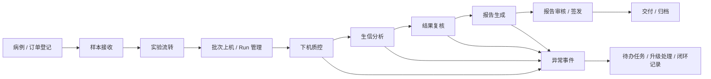

# 智慧化实验室产品蓝图与 MVP 路线图

更新时间：2026-03-23  
文档定位：产品顶层设计文档  
适用对象：产品经理、方案经理、设计师、研发负责人、业务负责人  
文档用途：统一产品定位、信息架构、设计原则和 0-1 路线

## 1. 文档结论

这套产品不应该被继续设计成“多个看板页面的集合”，而应该被定义为：

`一套面向临床基因检测实验室的运营、质控、结果复核与报告协作平台。`

从产品角度看，它的核心不是“展示数据”，而是三件事：

- 把实验室业务对象统一起来
- 把业务流程打通起来
- 把告警和指标落到具体动作上

如果只把它做成大屏或统计页，产品价值会停留在“汇报层”；  
如果把 `样本 -> 批次 -> 质控 -> 结果 -> 报告 -> 异常 -> 管理分析` 串起来，它才会变成真正的业务系统。

## 2. 产品定位

### 2.1 一句话定位

`帮助临床基因检测实验室实现样本流转透明化、质控可追溯、报告流程可协同、运营指标可管理的统一平台。`

### 2.2 建议产品名称

建议正式产品名称往“运营 + 质控 + 报告协同”方向靠，而不是继续只叫“看板”：

- `智慧化实验室运营与质控平台`
- `临床基因检测实验室智慧运营平台`
- `实验室全流程运营与报告协同平台`

如果保留“看板”这个词，建议只把它作为首页名称，而不是整套产品名称。

### 2.3 目标客户

- 临床基因检测实验室
- 分子诊断中心
- 肿瘤检测中心
- 遗传病检测实验室
- 第三方医学检验实验室

### 2.4 产品价值主张

- 对管理层：一眼看清产能、风险、时效和瓶颈
- 对主管：快速发现异常、定位责任、推动闭环
- 对一线：明确当前待办、减少跨系统切换、提升处理效率
- 对组织：统一口径、沉淀流程、降低返工和漏控

## 3. 产品目标与非目标

### 3.1 产品目标

首版产品的目标建议聚焦 4 个：

- 缩短端到端 `TAT`
- 提高关键节点 `SLA` 达成率
- 降低异常样本、退回、返工和漏控
- 提高实验室与分析团队的协作效率

### 3.2 非目标

首版不要把范围拉得太大，不建议一开始就覆盖：

- 全量 LIS / HIS / EMR 深度互联
- 原始测序数据处理引擎本身
- 全医院级别经营分析
- 医疗器械注册级合规闭环
- 复杂财务结算和供应链管理

这些内容可以放到后续阶段，不适合和 0-1 演示版混在一起。

## 4. 角色设计

### 4.1 核心角色

| 角色 | 核心目标 | 关注重点 | 常用页面 |
| --- | --- | --- | --- |
| 实验室负责人 | 保证产能、时效和质量 | TAT、SLA、异常、瓶颈、团队负载 | 首页、异常中心、管理分析 |
| 质控负责人 | 发现并关闭质量风险 | 批次质控、失控样本、特殊指标、趋势异常 | 批次与质控、异常中心 |
| 实验人员 | 推进样本按时流转 | 当前样本状态、待处理样本、截止时间 | 样本中心、批次中心 |
| 生信分析人员 | 完成分析与结果复核 | 待分析、待复核、变异结果、特殊指标 | 结果中心、待办中心 |
| 报告解读/审核人员 | 保障报告准确按时交付 | 待解读、待审核、退回报告、签发状态 | 结果中心、报告工作台 |
| 运营/客服 | 跟进交付和进度反馈 | 报告进度、延期风险、异常原因 | 样本中心、异常中心 |
| 系统管理员 | 保证口径和配置正确 | 项目、角色、SLA、模板、权限 | 系统配置 |

### 4.2 角色设计原则

- 同一个页面尽量服务一类决策，而不是服务所有人
- 管理角色看“趋势和风险”，执行角色看“待办和动作”
- 一个角色的首页，应该优先展示他今天要处理什么

## 5. 业务主线设计

### 5.1 端到端业务链

### 5.2 这条主线里的关键控制点

- 接样是否完整
- 样本是否超出时效
- 批次是否存在下机异常
- 结果是否存在失控或异常分布
- 报告是否被退回、卡住或超时
- 异常是否有人负责、是否已关闭

### 5.3 产品设计的核心要求

每一个“异常”都必须关联到：

- 对象
- 责任人
- 原因
- 处理动作
- 关闭状态

否则产品就会停留在“看见问题”，而不是“解决问题”。

## 6. 核心对象模型

### 6.1 必须统一的业务对象

整套产品建议围绕以下对象建模：

- `病例/订单`
- `样本`
- `批次`
- `Run / 上机任务`
- `质控结果`
- `分析 Case`
- `变异与特殊指标`
- `报告`
- `任务`
- `异常事件`
- `用户 / 角色`

### 6.2 对象关系建议

| 对象 | 说明 | 关键关系 |
| --- | --- | --- |
| 病例/订单 | 一次检测业务请求 | 可关联多个样本、一个或多个报告 |
| 样本 | 最核心流转对象 | 属于病例，进入某个批次，产生质控和结果 |
| 批次 | 实验组织单元 | 包含多个样本，关联 Run 和质控 |
| 质控结果 | 下机和结果质量数据 | 关联批次、样本、项目 |
| 分析 Case | 生信分析与解释对象 | 关联样本、变异、复核动作 |
| 报告 | 面向交付的正式资产 | 关联病例、样本、审核与签发状态 |
| 异常事件 | 风险和问题实体 | 关联对象、责任人、处理记录 |
| 任务 | 人需要做的动作 | 由状态变化或异常触发 |

### 6.3 关键设计建议

- 页面要围绕“对象”设计，而不是围绕“图表”设计
- 每个核心对象都应该有自己的详情页
- 首页和分析页的图表，最终都要能钻取到对象

## 7. 统一状态机设计

### 7.1 样本主状态建议

建议把样本作为最主干的状态机对象，状态尽量统一，不要各模块各叫各的：

| 状态 | 责任角色 | 目标动作 | 是否设 SLA |
| --- | --- | --- | --- |
| 已登记 | 运营/接样 | 完成接样信息确认 | 是 |
| 已接收 | 实验人员 | 准备实验处理 | 是 |
| 实验中 | 实验人员 | 完成提取/建库/实验步骤 | 是 |
| 待上机 | 实验人员 | 进入批次和上机安排 | 是 |
| 测序中 | 实验/设备 | 等待下机结果 | 是 |
| 待下机质控 | 质控人员 | 完成批次质量判定 | 是 |
| 待生信分析 | 生信人员 | 完成分析任务 | 是 |
| 待结果复核 | 生信/审核 | 完成结果复核 | 是 |
| 待报告生成 | 报告人员 | 生成报告草稿 | 是 |
| 待报告审核 | 审核人员 | 审核和退回/通过 | 是 |
| 待签发 | 负责人/签发人 | 完成签发 | 是 |
| 已发布 | 运营/系统 | 完成交付 | 否 |
| 已归档 | 系统 | 归档留痕 | 否 |

### 7.2 异常状态不要做成主状态

建议把“异常”设计成附着在主对象上的事件，而不是单独主状态。  
例如：

- 样本主状态：`待结果复核`
- 异常事件：`超 SLA`
- 异常等级：`高`
- 当前任务：`负责人 2 小时内处理`

这样设计更适合后续统计、升级和闭环。

### 7.3 统一状态设计的意义

- 减少跨模块口径不一致
- 保证钻取和汇总都能对齐
- 让所有统计指标都能追溯回状态变化

## 8. 产品信息架构

### 8.1 建议的一级导航

建议把当前原型的 6 个模块重构为以下一级导航：

- `总驾驶舱`
- `待办中心`
- `样本中心`
- `批次与质控`
- `结果与报告`
- `异常中心`
- `管理分析`
- `工具服务`
- `系统配置`

### 8.2 与当前原型的映射关系

| 当前模块 | 建议归属 |
| --- | --- |
| 实验室总览 | 总驾驶舱 |
| 测序下机数据质控 | 批次与质控 |
| 检测结果质量控制 | 批次与质控 / 结果与报告 |
| 人效分析 | 管理分析 |
| 科研画图服务 | 工具服务 |
| 实验室管理 alpha 版 | 样本中心 |

### 8.3 当前缺失但必须补的页面

从产品完整度来看，当前最值得新增的不是更多图表，而是这 3 个能力：

- `待办中心`
- `异常中心`
- `报告工作台`

原因很简单：

- 待办中心解决“今天谁做什么”
- 异常中心解决“问题怎么闭环”
- 报告工作台解决“报告如何协同交付”

## 9. 各一级导航设计建议

### 9.1 总驾驶舱

服务对象：

- 实验室负责人
- 主管
- 汇报对象

核心问题：

- 今天量有多少
- 哪些环节堵了
- 哪些风险最值得优先处理

建议保留模块：

- KPI 卡片
- 样本状态漏斗
- 流程滞留
- 实时异常中心
- 待办摘要
- 最近超时样本/报告

### 9.2 待办中心

服务对象：

- 所有一线执行角色

核心问题：

- 我今天需要处理哪些任务
- 哪些任务快超时了
- 哪些任务被退回了

建议内容：

- 我的待办
- 我负责的异常
- 今日新分配
- 即将超时
- 最近已完成

### 9.3 样本中心

服务对象：

- 实验人员
- 运营/客服
- 主管

核心问题：

- 当前样本在哪个状态
- 谁负责
- 距离截止时间还有多久
- 是否存在异常或退回

建议内容：

- 样本搜索与筛选
- 样本主列表
- 样本详情页
- 状态轨迹
- 当前任务
- 历史操作记录

### 9.4 批次与质控

服务对象：

- 质控负责人
- 实验人员
- 生信人员

核心问题：

- 哪个批次有风险
- 哪个项目偏离正常分布
- 哪些样本是离群点

建议内容：

- 批次列表
- Run 信息
- 下机原始质控
- 阳控/阴控
- 按项目箱型图
- 单样本质控明细
- 结果质控趋势

### 9.5 结果与报告

服务对象：

- 生信人员
- 报告人员
- 审核人员

核心问题：

- 哪些样本待分析、待复核、待签发
- 当前结论是否稳定
- 哪些报告被退回

建议内容：

- 结果中心
- 变异与特殊指标视图
- 项目级位点统计
- 报告草稿与审核流
- 签发记录

### 9.6 异常中心

服务对象：

- 主管
- 质控负责人
- 一线处理人

核心问题：

- 当前最严重的异常是什么
- 异常是否升级
- 处理到哪一步了

建议内容：

- 按等级分组
- 按对象类型分组
- 按责任人分组
- SLA 计时
- 处理记录
- 关闭原因

### 9.7 管理分析

服务对象：

- 管理层
- 主管

核心问题：

- 人效如何
- 项目产能如何
- 哪些环节拖慢了整体交付

建议内容：

- TAT 分析
- 人员吞吐
- 项目产能
- 异常趋势
- 退回和返工分析
- 组织/项目维度对比

### 9.8 工具服务

服务对象：

- 科研支持人员
- 生信/分析辅助角色

定位建议：

这是增值能力，不建议和核心业务主线抢一级导航优先级。

建议暂时保留：

- 科研画图服务
- 数据模板下载
- 图表示例生成

## 10. 产品体验原则

### 10.1 从“看见”走向“行动”

所有核心卡片都要满足：

- 能看
- 能点
- 能定位对象
- 能进入处理动作

### 10.2 一处筛选，全局统一

建议统一以下筛选口径：

- 时间范围
- 项目
- 产品
- 样本类型
- 实验室/组别
- 状态
- 责任人

避免每个页面都有自己的一套口径。

### 10.3 一类对象一个详情页

至少要给以下对象设计标准详情页：

- 样本详情
- 批次详情
- 异常详情
- 报告详情

### 10.4 首页是门面，不是终点

首页负责回答“哪里有问题”，  
工作台页面负责回答“怎么处理问题”。

### 10.5 指标必须可解释

每个 KPI 都应能追溯：

- 口径定义
- 计算规则
- 数据来源
- 明细列表

否则后期会频繁陷入“数据对不齐”的争论。

## 11. 数据与系统分层建议

### 11.1 顶层原则

产品蓝图不应该一开始就绑定某个底层系统，但要明确职责分层。

建议分为：

- `实验室运营事实源`
- `分析解读事实源`
- `报告事实源`
- `集成与指标计算层`
- `统一门户与工作台`

### 11.2 对应到现有方案

如果采用现有 `MISO + Scout + 自研前端` 路线，可以这样理解：

- `MISO`：实验室运营事实源
- `Scout`：分析与病例解读事实源
- `自研层`：统一门户、异常中心、报告工作台、驾驶舱

### 11.3 一个重要原则

`不要让首页看板直接承担业务录入职责。`

看板可以下钻、跳转、触发动作，但真正的流程写入最好落在明确的工作台或底层事实源里。

## 12. MVP 设计

### 12.1 MVP 目标

MVP 不是“把所有模块做全”，而是跑通一条最有演示价值的闭环：

`样本进入 -> 进入批次 -> 完成质控 -> 进入结果复核 -> 报告审核签发 -> 首页与异常中心可追踪`

### 12.2 MVP 必做范围

| 模块 | P0 能力 |
| --- | --- |
| 总驾驶舱 | KPI、流程滞留、实时异常、待办摘要 |
| 样本中心 | 样本列表、筛选、状态、详情、责任人 |
| 批次与质控 | 批次列表、下机质控、阳阴控、离群样本 |
| 结果与报告 | 待分析、待复核、待审核、待签发视图 |
| 异常中心 | 异常列表、等级、责任人、处理状态 |
| 管理分析 | TAT、人效、异常趋势基础版 |

### 12.3 MVP 暂缓项

首版建议暂时不做或弱化：

- 复杂科研画图解析
- 多组织多院区经营穿透
- 复杂权限矩阵
- 设备与耗材全生命周期
- 全量外部系统双向同步

## 13. 分阶段路线图

### 13.1 Phase 1：Demo 版

目标：

- 能讲清楚完整业务链
- 能演示角色差异
- 能体现异常闭环

重点交付：

- 总驾驶舱
- 样本中心
- 批次与质控
- 结果与报告基础页
- 异常中心基础版

### 13.2 Phase 2：内测版

目标：

- 让真实团队开始试用
- 验证状态机、待办机制和异常闭环

重点交付：

- 统一 ID 映射
- 角色化首页
- 报告工作台
- 更完整的日志留痕
- 数据导出与订阅

### 13.3 Phase 3：产品化版

目标：

- 可在真实项目里稳定运行

重点交付：

- API 集成
- 权限体系
- 审计日志
- 配置中心
- 模板和规则引擎
- 组织级指标管理

## 14. 核心指标设计

建议从第一天开始就统一北极星指标和过程指标。

### 14.1 北极星指标

- 端到端 `TAT`
- `SLA` 准时率
- 异常闭环时长
- 报告准时交付率

### 14.2 过程指标

- 样本在制量
- 各环节平均滞留时长
- 超时样本数
- 批次失控率
- 特殊指标阳性率异常波动
- 报告退回率
- 人均吞吐量

### 14.3 指标设计提醒

指标不要只做“展示”，每一项都要回答：

- 谁看它
- 为什么看它
- 看完之后做什么

## 15. 当前原型的优化方向

结合你现在的原型，建议按以下顺序优化：

### 15.1 先做结构收口

- 把“实验室总览”升级为“总驾驶舱”
- 把“实验室管理 alpha 版”升级为“样本中心”
- 把“qc-seq + qc-result”合并成“批次与质控”
- 把“科研画图服务”降级为“工具服务”

### 15.2 再补缺口

- 新增 `待办中心`
- 新增 `异常中心`
- 新增 `报告工作台`

### 15.3 最后再做深化

- 角色化首页
- 统一筛选器
- 对象详情页
- 操作日志和闭环记录

## 16. 最重要的几个设计决策

如果只能抓最关键的 5 个决定，我建议是这 5 个：

- 把产品从“看板”升级成“运营与质控平台”
- 统一 `样本` 作为主线对象
- 统一一套状态机和 SLA 字典
- 把“异常”设计成事件和任务，而不是只做红色提示
- 首页所有关键卡片必须能钻取到对象和动作

## 17. 接下来 2 周建议产出

如果继续往下推进，建议下一步按这个顺序做：

1. 产出《核心对象与状态字典》
2. 产出《异常中心设计方案》
3. 产出《报告工作台设计方案》
4. 产出《一级导航和页面线框图》
5. 产出《MVP 字段清单与接口映射表》

## 18. 结语

从顶层看，这个产品的关键不是多做几个图，而是把“流程、对象、异常、任务、责任”统一起来。

只要这条主线成立：

- 首页就不是孤立的看板
- 质控页就不是孤立的分析图
- 人效页就不是事后统计
- 实验室管理页就不是普通列表

它们会共同组成一套真正能演示、能管理、也能继续产品化的系统。
